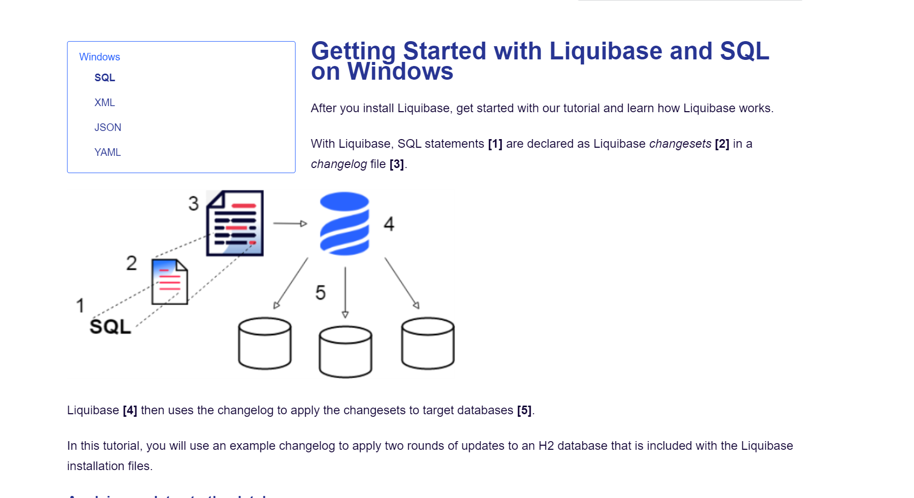
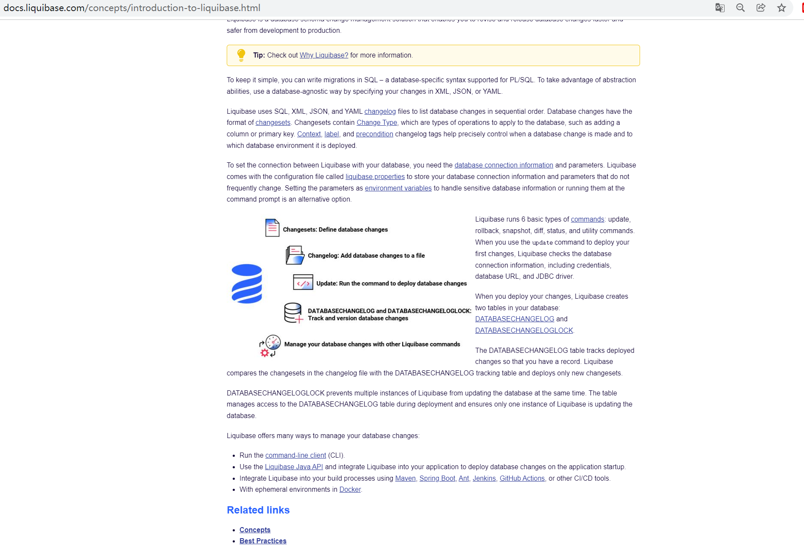
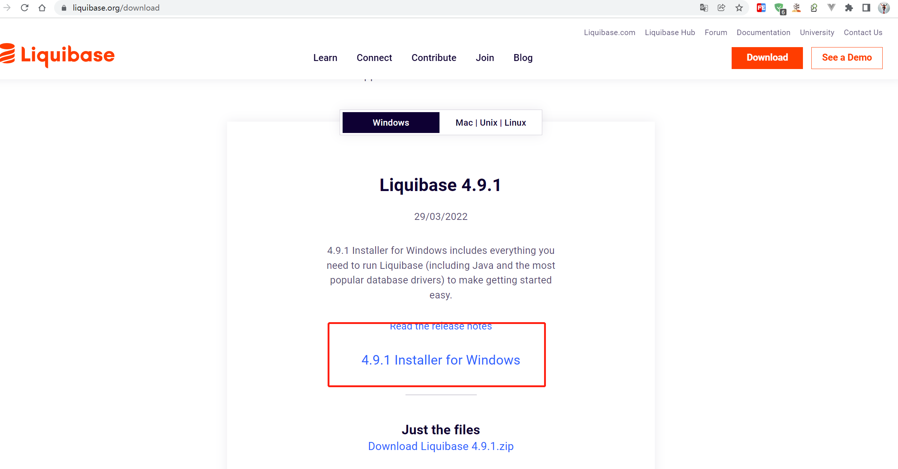
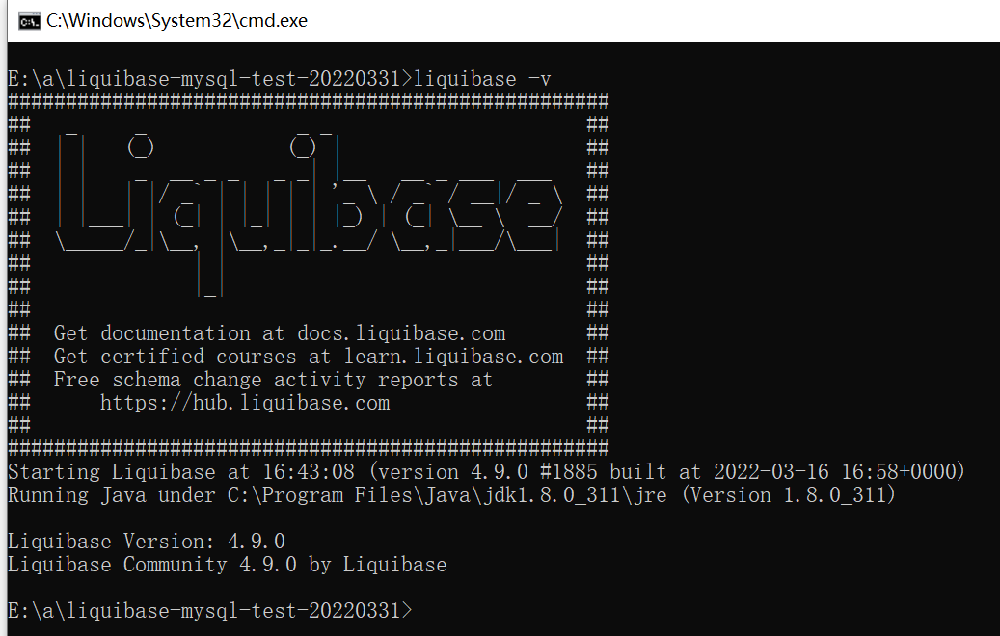
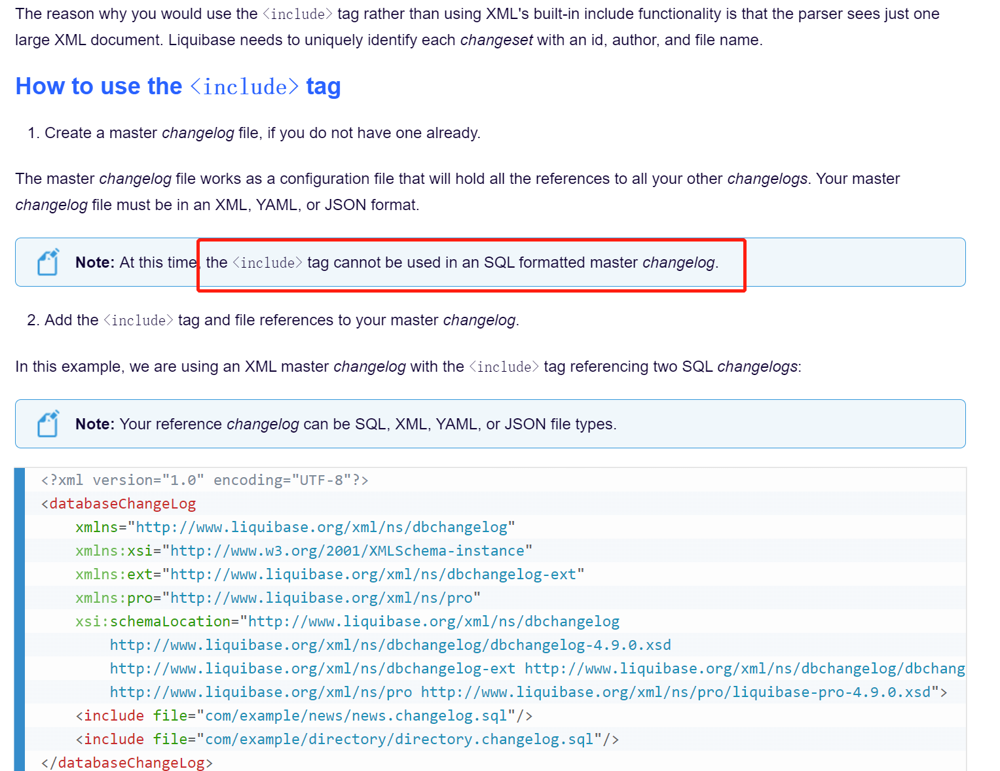
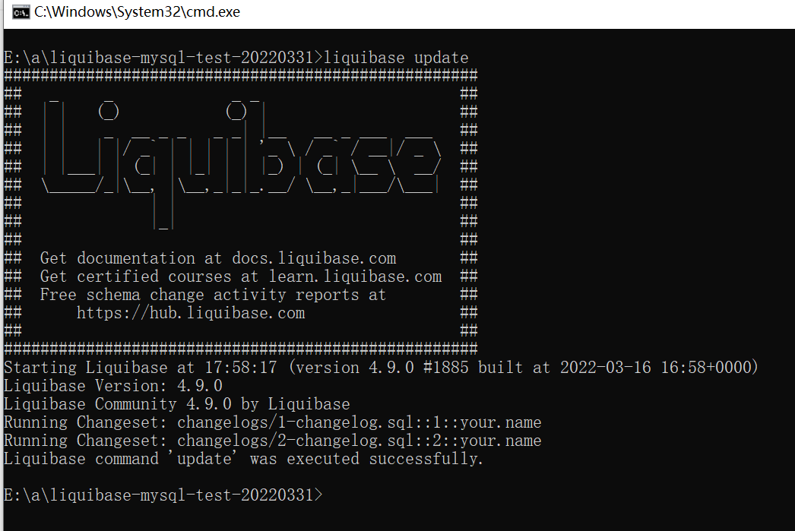
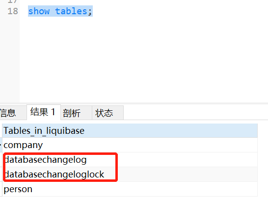
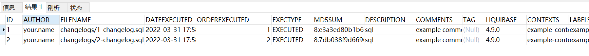
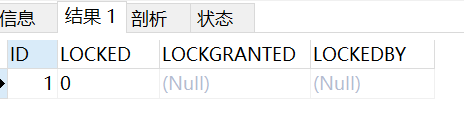

# liquibase quick start

## 核心概念






> refer to:
>
> https://docs.liquibase.com/concepts/introduction-to-liquibase.html
>
> https://docs.liquibase.com/concepts/home.html
>
> https://docs.liquibase.com/start/getting-started-liquibase-sql-windows.html
>
> https://docs.liquibase.com/change-types/home.html

## 前置条件

1. MySQL database
2. JDK8
3. apache-maven-3.8.4  or above
4. idea

## command使用(win10 with community install version)

see branch liquibase-with-maven-plugin for [hello-liquibase](git@github.com:OceanLeonAI/hello-liquibase.git)

### 安装

1. 下载 `https://liquibase.org/download`

   

2. 安装，记得安装过程中，选择加入环境变量

3. 验证，cmd窗口中输入 `liquibase -v`，控制台打印logo安装成功

   

### 初试

1. 新建`liquibase-mysql-test-20220331`文件夹

2. 在文件夹`liquibase-mysql-test-20220331`下新增`mysql-connector-java-8.0.20.jar`依赖

3. 在文件夹`liquibase-mysql-test-20220331`下新增`liquibase.properties`文件,具体内容参照 demo,该配置文件很重要！！！

   > 该文件包含
   >
   > 数据库配置
   >
   > 日志配置
   >
   > * 日志级别选择 DEBUG ERROR INFO ALL...
   > * 输出到控制台还是文件
   > * 日志名称,位置配置
   >
   > 输入文件位置配置
   >
   > * changeLogFile=master-changelog.xml
   >
   > 输出文件位置配置
   >
   > refer to: https://docs.liquibase.com/concepts/connections/creating-config-properties.html

4. 在文件夹`liquibase-mysql-test-20220331`下新增`master-changelog.xml`文件,具体内容参照 demo

   1. 该文件主要用于 include 分散的changelog文件

   2. 注意坑

      

      > refer to: https://docs.liquibase.com/concepts/changelogs/attributes/include.html

5. 在文件夹`liquibase-mysql-test-20220331`下新增`changelogs`文件夹,并在文件夹中新增changelog文件

   1. 新增`1-changelog.sql`
   2. 新增`2-changelog.sql`
   3. 新增`3-changelog.sql`
   4. 新增`4-changelog.sql`
   5. ...

   这些文件将会在文件`master-changelog.xml`中通过include标签被包含,如下

   ```xml
   <include file="changelogs/2-changelog.sql"/>
   ```

   以上xxx-changgelog.sql文件介绍

   > changelog文件可以是 sql,xml,yaml,json格式
   >
   > 具体内容是对数据库的 ddl dml等操作
   >
   > sql格式比较容易理解
   >
   > 包含关系：
   >
   > changelog file > changesets > changetype
   >
   > refer to:
   >
   >  https://docs.liquibase.com/concepts/changelogs/sql-format.html
   >
   > https://docs.liquibase.com/concepts/changelogs/working-with-changelogs.html


#### generateChangeLog 

> refer to:
>
>  https://docs.liquibase.com/concepts/connections/creating-config-properties.html
>
> https://docsstage.liquibase.com/commands/generatechangelog.html

1. 以`mysql`为例，对已有数据库，导出对应表结构changelog(包含)

   ```bash
   liquibase --changeLogFile=20220331-exist-data-structure.mysql.sql generateChangeLog
   ```

2. 以`mysql`为例，对已有数据库，导出对应表数据changelog,注意配置

   ```bash
   liquibase --changeLogFile=20220331-exist-data.mysql.sql --diffTypes=data generateChangeLog
   ```

#### update

> refer to:
>
> https://docs.liquibase.com/commands/home.html
>
> https://docs.liquibase.com/commands/update.html

1. 将changelog更新到数据库，在文件夹`liquibase-mysql-test-20220331`下打开cmd窗口，执行一下命令

   ```shell
   liquibase update
   ```

   

2. 查询数据库中生成的表,发现changelog中create的表已经同步到数据库

   

   * 其中

     * databasechangelog

       > The DATABASECHANGELOG table tracks deployed changes so that you have a record. Liquibase compares the changesets in the changelog file with the DATABASECHANGELOG tracking table and deploys only new changesets.

       

     * databasechangeloglock

       > DATABASECHANGELOGLOCK prevents multiple instances of Liquibase from updating the database at the same time. The table manages access to the DATABASECHANGELOG table during deployment and ensures only one instance of Liquibase is updating the database. 

       

#### rollback

##### rollback tag 回滚到某个版本

1. 执行完某次`update`操作以后需要给该次操作打标签

   ```shell
   liquibase tag v1
   ```

2. 回滚到一个tag

   ```shell
   liquibase rollback v2
   ```

> refer to:
>
> https://docs.liquibase.com/commands/rollbackbytag.html

##### rollbackToDate 回滚到指定时间

|   Attribute   |                          Definition                          | Requirement  |
| :-----------: | :----------------------------------------------------------: | :----------: |
| `--date/time` | The date and time your database rolls back to. The date format is `YYYY-MM-DD HH:MM:SS` or `YYYY-MM-DD'T'HH:MM:SS`, however, it is possible to indicate the date or time only. | **Required** |

```shell
liquibase rollbackToDate 2020-03-31 12:01:23
```

> refer to:
>
> https://docs.liquibase.com/commands/rollbacktodate.html

##### rollbackCount  表示rollback的changeset的个数 

```shell
liquibase rollbackCount 1
```

或者

```shell
liquibase rollback-count 1
```

> refer to:
>
> https://docs.liquibase.com/commands/rollbackcount.html

##### rollback conclusion

|                           Command                            |                         Description                          |
| :----------------------------------------------------------: | :----------------------------------------------------------: |
| [rollback](https://docs.liquibase.com/commands/rollbackbytag.html) | Rolls back the database to the state it was in when the tag was applied. |
| [rollbackSQL](https://docs.liquibase.com/commands/rollbacksqltag.html) | A helper command that produces the raw SQL Liquibase would run when using the `rollbackByTag` command. |
| [rollbackToDate](https://docs.liquibase.com/commands/rollbacktodate.html) | Rolls back the database to the state it was in at the given date/time. |
| [rollbackToDateSQL](https://docs.liquibase.com/commands/rollbacktodatesql.html) | A helper command that allows you to inspect the SQL Liquibase will run while using the [rollbackToDate](https://docs.liquibase.com/commands/rollbacktodate.html) command. |
| [rollbackCount](https://docs.liquibase.com/commands/rollbackcount.html) |         Rolls back the last <value> *changeset**s*.          |
| [rollbackCountSQL](https://docs.liquibase.com/commands/rollbackcountsql.html) | Writes SQL to roll back the last <value> *changeset**s* to `STDOUT`. |
| [rollbackOneChangeSet](https://docs.liquibase.com/commands/rollbackonechangeset.html)[](https://www.liquibase.com/trial) | Rolls back a single *changeset* without needing to roll back other already applied *changeset*. |
| [rollbackOneChangeSetSQL](https://docs.liquibase.com/commands/rollbackonechangesetsql.html)[](https://www.liquibase.com/trial) |  Writes SQL to roll back a single *changeset* to `STDOUT`.   |
| [rollbackOneUpdate](https://docs.liquibase.com/commands/rollbackoneupdate.html)[](https://www.liquibase.com/trial) | Rolls back all *changesets* related by a specific `deploymentId` that was made during a previous change to your database. |
| [rollbackOneUpdateSQL](https://docs.liquibase.com/commands/rollbackoneupdatesql.html)[](https://www.liquibase.com/trial) | A helper command that allows you to inspect the SQL Liquibase will run to revert all *changeset* associated with the `deploymentID` specified in the [rollbackOneUpdate](https://docs.liquibase.com/commands/rollbackoneupdate.html) command. |
| [futureRollbackSQL](https://docs.liquibase.com/commands/futurerollbacksql.html) | Writes SQL to roll back the database to the current state after the changes in the *changelog* have been applied. |
| [futureRollbackCountSQL](https://docs.liquibase.com/commands/futurerollbackcountsql.html) | Generates the SQL that Liquibase would use to sequentially revert the number of changes associated with undeployed *changeset**s*, which are added to a *changelog* file. |
| [future-rollback-from-tag-sql](https://docs.liquibase.com/commands/future-rollback-from-tag-sql.html) | Produces the raw SQL Liquibase would need to roll back all undeployed changes made up to the specified tag. |

> refer to:
>
> https://docs.liquibase.com/commands/home.html

## maven-plugin 使用

see branch liquibase-with-maven-plugin for [hello-liquibase](git@github.com:OceanLeonAI/hello-liquibase.git)

> refer to:
>
> https://docs.liquibase.com/tools-integrations/maven/maven-pom-file.html
>
> https://docs.liquibase.com/tools-integrations/maven/commands/home.html

## 集成 springboot 使用

see branch liquibase-with-spring-boot for [hello-liquibase](git@github.com:OceanLeonAI/hello-liquibase.git)

## Jenkins 使用 todo

